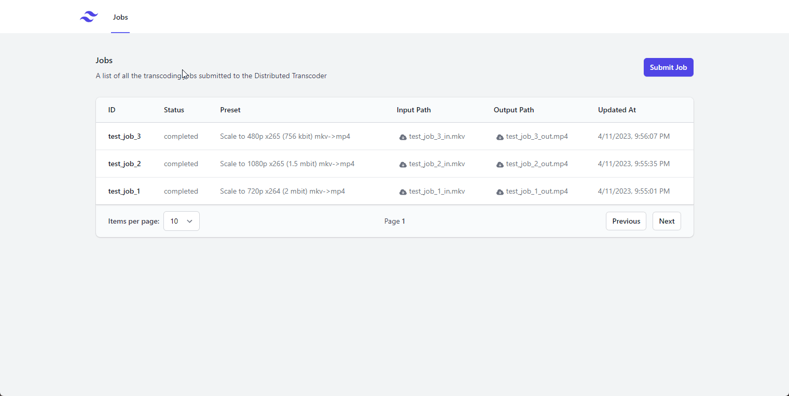

# Video Transcoding Service

A distributed video transcoding service using RabbitMQ, GStreamer, and S3-compatible object storage (such as MinIO) with a React frontend.

### Video Demo



## Overview

This project is a distributed video transcoding service that leverages RabbitMQ for job distribution, GStreamer for video transcoding, and an S3-compatible object storage (such as MinIO) for storing input and output video files. It also includes a React frontend for user interaction.

The service consists of the following components:

- RabbitMQ: used for managing and distributing transcoding jobs.
- GStreamer: a multimedia processing framework used for transcoding video files.
- S3-compatible object storage (e.g., MinIO): used for storing input and output video files.
- FastAPI: a modern, fast (high-performance) web framework for building APIs.
- React: a JavaScript library for building user interfaces.

## Getting Started

### Prerequisites

- Docker
- Docker Compose
- Node.js and npm (for the frontend)

### Setting up the environment

1. Clone the repository.

    ```shell
    $ git clone https://github.com/yourusername/video-transcoding-service.git
    $ cd video-transcoding-service
    ```

2. Create a `.env` file in the project root directory with the following content:

    ```
    AWS_ACCESS_KEY_ID=your_access_key
    AWS_SECRET_ACCESS_KEY=your_secret_key
    S3_BUCKET_NAME=your_bucket_name
    AWS_S3_ENDPOINT_URL=http://minio:9000
    ```

Replace `your_access_key`, `your_secret_key`, and `your_bucket_name` with the appropriate values for your S3-compatible object storage.

3. Start the services using Docker Compose:

    ```shell
    $ docker-compose up
    ```

4. Install the frontend dependencies and start the development server:

    ```shell
    $ cd frontend
    $ npm install
    $ npm start
    ```

The React frontend will be available at `http://localhost:3000`.

## Usage

1. **Upload a video file**: Open the React frontend at `http://localhost:3000` and use the "Upload Source File" section to select and upload a video file.

2. **Submit a transcoding job**: In the "Submit Transcoding Job" section, enter a Job ID, and click the "Submit Job" button.

3. **Monitor the progress of the transcoding job**: The progress of the transcoding job will be displayed in the "Job Progress" section.

4. **Download the output file**: Once the transcoding job is completed, the output file will be uploaded to the specified output key in the S3-compatible object storage. A download link will be provided in the "Job Progress" section.

Alternatively, you can use the FastAPI endpoints as described in the original README.md.
